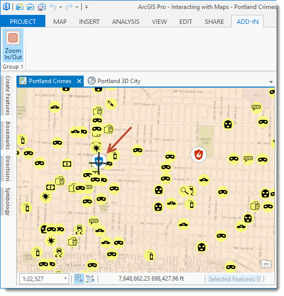

##V_3D_Addin

<!-- TODO: Write a brief abstract explaining this sample -->
Learn how to develope addins for ArcGIS Pro and 3D animation with ArcGIS Pro.    
  


<a href="http://pro.arcgis.com/en/pro-app/sdk/" target="_blank">View it live</a>

<!-- TODO: Fill this section below with metadata about this sample-->
```
Language:              C#
Subject:               Framework
Contributor:           Qing Zhong	
Organization:          GA, http://www.ga.gov.au
Date:                  10/03/2017
ArcGIS Pro:            1.3
Visual Studio:         2015
.NET Target Framework: 4.6.2
```

##Resources

* [API Reference online](http://pro.arcgis.com/en/pro-app/sdk/api-reference)
* <a href="http://pro.arcgis.com/en/pro-app/sdk/" target="_blank">ArcGIS Pro SDK for .NET (pro.arcgis.com)</a>
* [arcgis-pro-sdk-community-samples](http://github.com/Esri/arcgis-pro-sdk-community-samples)
* [ArcGISPro Registry Keys](http://github.com/Esri/arcgis-pro-sdk/wiki/ArcGIS-Pro-Registry-Keys)
* [FAQ](http://github.com/Esri/arcgis-pro-sdk/wiki/FAQ)
* [ArcGIS Pro SDK icons](https://github.com/Esri/arcgis-pro-sdk/releases/tag/1.4.0.7198)
* [ProConcepts: ArcGIS Pro Add in Samples](https://github.com/Esri/arcgis-pro-sdk-community-samples/wiki/ProConcepts-ArcGIS-Pro-Add-in-Samples)


##How to use the sample
<!-- TODO: Explain how this sample can be used. To use images in this section, create the image file in your sample project's screenshots folder. Use relative url to link to this image using this syntax:  -->
1. Open this solution in Visual Studio 2015.    
1. Click the build menu and select Build Solution.  
1. Click the Start button to open ArCGIS Pro.  ArcGIS Pro will open.  
1. Create a project ****.  
1. Click on the Add-in tab   
1. Click the 'V_3D' button and left click on the map somewhere off the map center.  
  
  
 


[](Esri Tags: ArcGIS-Pro-SDK)
[](Esri Language: C-Sharp)​

&nbsp;&nbsp;&nbsp;&nbsp;&nbsp;&nbsp;
&nbsp;&nbsp;&nbsp;&nbsp;&nbsp;&nbsp;&nbsp;&nbsp;&nbsp;&nbsp;&nbsp;&nbsp;
